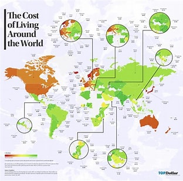

# Understanding Global Cost of Living

## Project Description

Understanding the cost of living is crucial for various stakeholders, from businesses making relocation decisions to individuals considering moves abroad. This analysis explores the Cost of Living Index and its related indices, which measure the relative cost of living across countries compared to New York City (NYC), serving as the baseline (100%). The data provides valuable insights into the prices of consumer goods, rent, groceries, restaurant prices, and local purchasing power in different countries, offering a comprehensive understanding of how living expenses vary globally.

This analysis leverages a dataset from Kaggle, which contains the 2024 cost of living data for countries worldwide. The goal of this study is to identify cost patterns, help expatriates plan financially, assist businesses in making informed decisions, and provide investors with insights into potential opportunities in real estate or businesses in countries with varying living costs.

## Understanding Cost of Living
The cost of living indices provided on this website are relative to New York City (NYC), with a baseline index of 100% for NYC.

### Here's a breakdown of each index and its meaning:

**Cost of Living Index (Excl. Rent):** This index indicates the relative prices of consumer goods like groceries, restaurants, transportation, and utilities. It excludes accommodation expenses such as rent or mortgage. For instance, a city with a Cost of Living Index of 120 is estimated to be 20% more expensive than New York City (excluding rent).

**Rent Index:** This index estimates the prices of renting apartments in a city compared to New York City. If the Rent Index is 80, it suggests that the average rental prices in that city are approximately 20% lower than those in New York City.

**Cost of Living Plus Rent Index:** This index estimates consumer goods prices, including rent, in comparison to New York City. Groceries Index: This index provides an estimation of grocery prices in a city relative to New York City. Numbeo uses item weights from the "Markets" section to calculate this index for each city.

**Restaurants Index:** This index compares the prices of meals and drinks in restaurants and bars to those in NYC.

**Local Purchasing Power:** This index indicates the relative purchasing power in a given city based on the average net salary. A domestic purchasing power of 40 means that residents with an average salary can afford, on average, 60% less goods and services compared to residents of New York City with an average salary.

**Link to the dataset:** [Here](https://www.kaggle.com/datasets/myrios/cost-of-living-index-by-country-by-number-2024/data?select=Cost_of_Living_Index_by_Country_2024.csv)

The aim of this analysis is to assess the global cost of living across various countries, identifying key factors influencing the cost of living and their relationships with economic indicators such as rent, groceries, and local purchasing power. This will help us understand the disparities in living standards and make informed decisions on budgeting, relocation, investment, and policy-making.

**(A) Analyze the distribution of cost of living indices:**
Explore the distribution of the Cost of Living Index, Rent Index, Groceries Index, Restaurant Price Index, and Local Purchasing Power Index across different countries. Identify the range and variations within these indices to understand global disparities in living costs.

**(B) Identify top and bottom countries by index:**
Rank countries with the highest and lowest cost of living, rent, groceries, and other indices. Create bar charts to visually represent the top 5 and bottom 5 countries for each index, providing insights into the most and least expensive countries for various expenses.

**(C) Examine relationships between indices:**
Use scatter plots to visualize and analyze the relationships between different indices, such as: Cost of Living Index vs. Rent Index Cost of Living Index vs. Groceries Index Rent Index vs. Local Purchasing Power Index

**(D) Identify correlations to understand how different factors interact with one another and how they collectively influence the overall cost of living.**

### Highlight key global trends
Draw conclusions on global trends in living standards, such as whether high rent is typically associated with high costs of groceries or if local purchasing power can offset higher living expenses. Use these trends to offer insights into the economic environments of various regions.

## Project Tasks

View the Jupyter notebook to explore the project tasks and the expected outputs [Here](https://github.com/omoniyidamilola/Understanding-Global-Cost-ofLiving/blob/main/Understanding%20Global%20Cost%20of%20Living.ipynb)
--       

Check out the Medium article I wrote about this project [Here](https://medium.com/@innocentdamilola45/overview-dfe2195dc465)
